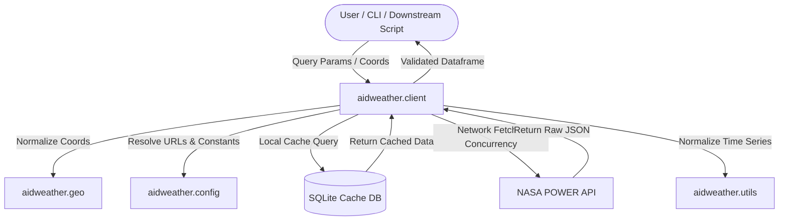

# AIDWEATHER Workspace Developer & Agent Guide

This file provides rules, coding standards, and architectural guidance for agents and developers working on the `aidweather` project.

---

## 1. Project Mission & Goal

`aidweather` is a foundational data-ingestion layer designed to fetch, cache, and validate daily and hourly meteorological and solar data from **NASA's POWER API** for agricultural and environmental applications.

The key objectives are:
- **Minimize API Traffic**: Prevent redundant web requests by caching retrieved data locally in an SQLite database.
- **Robust Coordinate Normalization**: Automatically convert different coordinate formats (DMS, DDM, DD) into validated decimal degrees.
- **Idempotency & Clean Schemas**: Return timezone-agnostic, standardized pandas DataFrames with numeric types and standard `NaN` values (coerced from NASA's `-999` fill values), indexed by a `DatetimeIndex`.

---

## 2. Architecture Overview

`aidweather` is built with a modular, src-oriented layout. The core modules cooperate as follows:

### Module Breakdown
1. **`aidweather.config`**:
   - Exposes a singleton configuration object `cfg` (and its helper `get_config`).
   - Loads bundled JSON settings (`assets/config.json`) using `importlib.resources`.
   - Supports overrides via environment variables (e.g., `AIDWEATHER_CACHE_DIR`, `AIDWEATHER_LOG_DIR`).
2. **`aidweather.geo`**:
   - Defines the immutable value object `GeoCoordinate`.
   - Normalizes coordinate input formats (DMS, DDM, DD) using regular expressions.
   - Validates latitude in `[-90, 90]` and longitude in `[-180, 180]`.
3. **`aidweather.client`**:
   - Implements the core client `PowerClient` that orchestrates fetching and caching.
   - Uses Pydantic models (`PointRequest`, `TransectRequest`, `RegionalRequest`) for validation.
   - Stores cache entries compressed with `gzip` inside an SQLite database to optimize disk footprint.
   - Handles parallel querying of multi-point/transect ranges with a ThreadPoolExecutor and handles rate limiting.
4. **`aidweather.utils`**:
   - Contains general DataFrame utilities, primarily `ensure_date_column`, which normalizes date columns or indexes into a clean `datetime64[ns]` timezone-naive column.
5. **`aidweather.cli`**:
   - Exposes user CLI entry points using `Typer` and formats user-facing tabular feedback via `Rich`.

---

## 3. NASA POWER Data Flow & Ingestion Workflow

To get and clean up weather data, `aidweather` implements the following exact pipeline:

1. **Input Normalization**:
   - Geographic coordinates are validated and converted to a `GeoCoordinate` value object.
   - Start and end dates are normalized to `YYYYMMDD` formats.
2. **Cache Key Generation**:
   - A unique SHA-256 cache key is constructed using coordinate values (lat/lon), parameters list, temporal resolution (daily/hourly), elevation, and other request criteria. Notice that the *requested date range is excluded from the cache key*.
3. **Cache Lookup & Interval Splitting**:
   - The SQLite database is queried for the cache key.
   - If an entry exists, `aidweather` compares the requested date range against the cached date range.
   - If the requested date range is wider than what is cached, `aidweather` splits the query, identifying the missing leading and/or trailing date sub-ranges that must be fetched from the network.
4. **API Querying**:
   - A `requests.Session` with automatic retry limits, backoffs, and rate limiting queries the NASA POWER API for the missing sub-ranges only.
5. **JSON Parsing & Merging**:
   - Raw JSON responses are parsed.
   - Invalid values or missing identifiers (NASA uses `-999` and `-999.0` for missing fields) are coerced into standard numpy/pandas `NaN`s.
   - The newly fetched data is merged with the cached data, sorted by date, and deduplicated.
6. **Cache Update**:
   - The updated DataFrame is converted back to a compact JSON shape, compressed with `gzip`, and saved back to the SQLite cache under the same cache key.
7. **Return Results**:
   - An inclusive date slice of the final DataFrame matching the exact user range is returned.

---

## 4. Coding & OOP Standards

When writing code for `aidweather`, you must adhere to the following principles:

- **Python Version**: Target Python 3.10+ (specifically compatibility up to 3.12+). Use standard type hinting for all public functions and methods.
- **String Literals**: Never create string literals that span multiple lines unless they are enclosed in triple quotes (`"""..."""` or `'''...'''`). If single/double quotes must span lines, escape any newlines as `\n`.
- **Value Objects**: Use frozen dataclasses for domain entities like [GeoCoordinate](file:///home/clever/aidbio/dev/aidweather/src/aidweather/geo.py) that represent values without identity.
- **Request Models**: Use Pydantic's `BaseModel` for validation of complex query payloads.
- **Thread Safety**: Ensure caching is thread-safe. SQLite connections in `PowerClient` are initialized with `check_same_thread=False` and a `timeout=10` to avoid database locked errors during concurrent fetching tasks.
- **Exception Discipline**: Validate inputs early. Fail loudly by raising informative exceptions (`ValueError`, `TypeError`) rather than returning partial or corrupted states.

---

## 5. Style, Linting & Formatting

The codebase enforces strict styling rules via `pyproject.toml` tool configurations:

- **Line Length**: Hard limit of `88` characters (Black/Ruff defaults).
- **Ruff**: Configured to run check categories `E` (errors), `F` (Pyflakes), `I` (isort/imports), `UP` (pyupgrade), and `B` (bugbear).
- **Mypy**: Configured with strict typing constraints (`python_version = "3.10"`, `ignore_missing_imports = true`, `warn_unused_configs = true`).

Make sure imports are grouped systematically:
1. Standard library imports
2. Third-party imports (e.g., pandas, pydantic, requests)
3. Local application imports (e.g., `aidweather.*`)

---

## 6. Testing Guidelines

Tests are powered by `pytest`. You must follow these test rules:

- **Test Locations**: Keep tests organized inside [tests/](file:///home/clever/aidbio/dev/aidweather/tests) and [examples/brazil/](file:///home/clever/aidbio/dev/aidweather/examples/brazil).
- **Mocking**: Always mock the NASA POWER API requests using `requests_mock` fixtures. Never make actual internet calls during regular unit testing.
- **Database Cleanup**: When instantiating `PowerClient` in test scopes, always make sure the SQLite database connection is closed properly on teardown. An automatic cleanup fixture in [conftest.py](file:///home/clever/aidbio/dev/aidweather/tests/conftest.py) is implemented to track and close all client connections and avoid resource warnings.
- **Execution Command**: Use `uv run pytest` or `pytest` to run the test suite.

---

## 7. Releases and Version Control

- Maintain a clean `CHANGELOG.md` detailing new features, bug fixes, or breaking changes.
- Follow semantic versioning (`MAJOR.MINOR.PATCH`).
- Keep public APIs backwards compatible unless a breaking change is explicitly requested.
