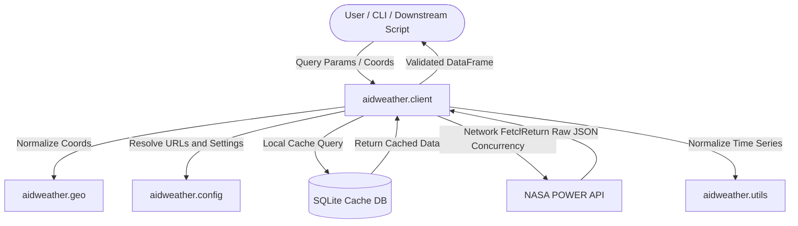

# AGENTS.md — aidweather Developer and Release Guide

This file is the working contract for coding agents and human contributors preparing
`aidweather` for beta release. Follow it before editing code, documentation,
packaging metadata, tests, or examples.

`aidweather` is a Python package for fetching, caching, normalizing, and validating
meteorological and solar data from NASA POWER for agricultural and environmental
analysis. The public interface is a Python API, a Typer/Rich CLI, documentation,
and examples.

Keep this file practical. Do not add generic coding advice unless it changes how
work should be done in this repository.

---

## 1. Current repository facts

- Repository: `matiollipt/aidweather`.
- Package layout: `src/aidweather`.
- Package name: `aidweather`.
- Current package metadata declares Python `>=3.10`, Apache-2.0 license, and beta
  development status.
- Current public version must stay synchronized across:
  - `pyproject.toml`
  - `src/aidweather/__init__.py`
  - `CHANGELOG.md`
- Main package entry point: `aidweather = "aidweather.cli:app"`.
- Main public API exports are currently:
  - `PowerClient`
  - `GeoCoordinate`
  - `normalize_coord_input`
  - `cfg`
  - `get_config`
  - `ensure_date_column`

Before changing public behavior, inspect the corresponding docs and examples.
Do not rely only on source-code inference.

---

## 2. Agent operating rules

When assigned a task:

1. Inspect the relevant source files, tests, docs, and `pyproject.toml` before
   editing.
2. Prefer small, targeted patches. Do not refactor unrelated code.
3. Preserve public APIs unless the task explicitly asks for a breaking change.
4. Keep user-facing behavior stable unless tests/docs are updated together.
5. Add or update tests for every functional change.
6. Keep README, docs, examples, and CLI help aligned with implemented behavior.
7. Do not make live NASA POWER calls in unit tests.
8. Do not commit generated outputs, local caches, notebooks outputs, build
   artifacts, API response dumps, or private credentials.
9. If behavior is uncertain, write a failing or exploratory test first, then fix.
10. If a task conflicts with this file, follow the more specific user instruction,
    but document the reason in the final response or PR notes.

Do not invent undocumented NASA POWER limits, variables, endpoints, or license
terms. Use repository docs or official NASA POWER documentation when changing
provider behavior.

---

## 3. Project mission and data contract

`aidweather` is a responsible ingestion layer over NASA POWER. Its core goals are:

- Minimize upstream API traffic through local SQLite caching.
- Normalize geographic coordinate inputs from decimal degrees, DMS, and DDM into
  validated decimal degrees.
- Validate request payloads before network calls.
- Return predictable pandas DataFrames with clean date handling and numeric data.
- Convert NASA missing values such as `-999` and `-999.0` into standard
  NumPy/pandas missing values.
- Keep returned data idempotent for the same request and cache state.
- Make provenance, NASA attribution, and package version clear in docs and
  downstream examples.

Expected returned DataFrame behavior:

- Date/time values are normalized consistently.
- Public functions should not silently return partial corrupted data.
- Numeric POWER variables should be numeric after parsing.
- Missing values should use standard pandas/NumPy missing-value semantics.
- Returned date ranges should match the user-requested inclusive range.

---

## 4. Architecture map



Primary modules:

- `aidweather.client`: `PowerClient`, request validation, NASA POWER calls,
  retries, rate limiting, interval splitting, cache reads/writes, parsing, and
  public fetch methods.
- `aidweather.geo`: coordinate value objects and coordinate parsing.
- `aidweather.config`: bundled config, default directories, environment overrides,
  and runtime configuration access.
- `aidweather.utils`: DataFrame/date normalization helpers.
- `aidweather.cli`: Typer CLI and user-facing Rich output.
- `aidweather.assets`: bundled JSON and style assets included through package data.
- `docs/`: user-facing and developer-facing documentation.
- `tests/`: pytest suite.
- `examples/brazil/`: example workflows that are also configured as pytest test
  paths.

When adding a feature, update all layers that are affected: model/validation,
client implementation, CLI, tests, docs, and examples.

---

## 5. NASA POWER workflow contract

The client workflow should remain:

1. Normalize coordinate, temporal API, community, parameter list, date range, and
   endpoint-specific request options.
2. Validate NASA POWER limits before network access.
3. Generate a stable cache key from request-defining dimensions such as location,
   temporal resolution, parameter set, community, endpoint, and relevant options.
4. Exclude only the date interval from the cache key when the implementation is
   deliberately using interval expansion for the same underlying data series.
5. Look up the existing cache entry.
6. Determine whether the requested interval is fully cached, partially cached, or
   absent.
7. Fetch only missing leading/trailing intervals when safe to do so.
8. Parse NASA JSON into a normalized DataFrame.
9. Replace POWER fill values with standard missing values.
10. Merge cached and newly fetched data, sort by time, deduplicate, and validate.
11. Store the updated payload compressed in SQLite.
12. Return only the exact user-requested inclusive range.

Be careful when changing cache keys. A cache-key change can invalidate existing
user caches or, worse, mix incompatible payloads. If a cache schema/key change is
required, document it in `CHANGELOG.md` and consider a migration or cache-version
namespace.

---

## 6. NASA POWER usage guardrails

Respect upstream service constraints:

- Daily point requests support up to 20 parameters per request.
- Hourly point requests support up to 15 parameters per request.
- Regional requests support 1 parameter per request.
- Regional bounding boxes must not exceed 4.5 degrees on either axis.
- Default multi-request concurrency should stay at or below 5 workers.
- Client-side rate limiting and retry/backoff behavior must not be removed.
- Cache-first behavior is part of the package's responsible-use design.
- POWER temporal APIs use Local Solar Time by default; do not describe this as
  civil local time unless an endpoint option explicitly changes it.

For workflows covering many grid cells, many years, or many variables, prefer
using cache-aware batching or NASA's bulk/analysis-ready data routes rather than
hammering the live API.

---

## 7. Coding standards

- Target Python 3.10+.
- Use type hints for public functions, methods, and dataclass/model fields.
- Prefer explicit validation errors over silent coercion for invalid user input.
- Use Pydantic models for complex request payload validation.
- Use frozen dataclasses for immutable value objects such as coordinates.
- Keep functions small enough to test directly.
- Do not hide network, parsing, or cache failures behind broad `except` blocks.
- Use precise exception messages that mention the invalid field or failed action.
- Preserve platform-independent paths via `pathlib` and `platformdirs` where
  appropriate.
- Do not hardcode local absolute paths such as `/home/...` in docs, tests, or
  code.
- Do not add mandatory dependencies unless they are required for core package
  operation.
- Keep optional or heavy data-science dependencies out of the core dependency set
  unless release packaging has been verified.

String-literal rule:

- Do not create accidental multi-line single-quoted or double-quoted strings.
- Use triple-quoted strings for docstrings and intended multi-line text.
- Use explicit `\n` joins when constructing compact error/help messages.

Threading/cache rule:

- SQLite access must remain safe under concurrent fetch workflows.
- If changing connection lifecycle, locks, or `check_same_thread` behavior, add
  concurrency-oriented tests or a documented smoke test.

---

## 8. Formatting, linting, and typing

The repository currently uses Ruff and mypy settings in `pyproject.toml`.

Expected local checks before considering a code task complete:

```bash
uv run ruff check src/ tests/
uv run mypy src/aidweather
uv run --with-editable . --extra test pytest -q
```

The release checklist also uses:

```bash
python -m build
python -m twine check dist/*
```

Import order:

1. Standard library
2. Third-party packages
3. Local `aidweather.*` imports

Do not add broad lint ignores to silence problems. Prefer local, justified ignores
only when the alternative is worse.

---

## 9. Testing policy

Use pytest. Tests should be deterministic and must not depend on live NASA POWER
availability.

Rules:

- Mock HTTP requests using `requests_mock` or equivalent test fixtures.
- Use temporary cache directories/databases for cache tests.
- Close `PowerClient` / SQLite resources after tests.
- Test both cache-hit and cache-miss paths when changing client behavior.
- Test invalid inputs as well as successful requests.
- Test date parsing, inclusive slicing, missing-value conversion, and dtype
  stability for parser changes.
- For CLI changes, include command-level tests or documented manual smoke tests.
- Keep example tests lightweight; do not turn examples into slow integration
  suites.

Minimum test coverage expectations for beta preparation:

- Coordinate parsing and validation.
- Point daily fetch parsing.
- Point hourly fetch parsing when supported.
- Parameter-limit validation.
- Regional request validation.
- Cache interval expansion and deduplication.
- Retry/rate-limit behavior at the unit level, without sleeping for long periods.
- CLI help and at least one successful mocked fetch path.

---

## 10. Documentation policy

Any user-facing behavior change must update documentation in the same patch.

Primary docs to check:

- `README.md`
- `docs/client.md`
- `docs/config.md`
- `docs/geo.md`
- `docs/utils.md`
- `docs/api_inventory.md`
- `docs/aidweather_nasa_power_usage.md`
- `docs/NASA_POWER_Licence_Usage.md`
- `docs/release_checklist.md`
- `docs/data_source_comparison.md`

Documentation must distinguish clearly between:

- Observed station data
- Reanalysis data
- Satellite-derived data
- Blended satellite/station products
- Forecast/model-generated data
- NASA POWER API extraction products

Do not imply NASA endorsement. Include NASA POWER attribution where relevant.
Use the current package version in examples or avoid hardcoding a version when the
text would become stale.

---

## 11. CLI policy

The CLI is user-facing and must remain conservative.

When editing `aidweather.cli`:

- Keep command names stable unless a breaking change is approved.
- Validate inputs before network calls.
- Use clear Rich output for human-readable summaries.
- Preserve machine-readable output options such as CSV/Parquet where implemented.
- Do not print tracebacks for normal user errors.
- Ensure `aidweather --help`, command help, and README examples stay aligned.

Recommended smoke checks after CLI changes:

```bash
aidweather --help
aidweather params list
aidweather cache info
```

For mocked or local dry runs, also test one point fetch and one file-output path.

---

## 12. Packaging and beta-release policy

Before beta release, verify the packaging surface carefully.

Required checks:

```bash
uv run --with-editable . --extra test pytest -q
uv run ruff check src/ tests/
uv run mypy src/aidweather
python -m build
python -m twine check dist/*
```

Then smoke-test the built wheel in a clean environment:

```bash
python -m venv /tmp/aidweather-wheel-smoke
/tmp/aidweather-wheel-smoke/bin/python -m pip install dist/*.whl
/tmp/aidweather-wheel-smoke/bin/python -c "import aidweather; print(aidweather.__version__)"
/tmp/aidweather-wheel-smoke/bin/aidweather --help
/tmp/aidweather-wheel-smoke/bin/aidweather params list
```

Beta-release checklist:

- Version synchronized in `pyproject.toml`, `src/aidweather/__init__.py`, and
  `CHANGELOG.md`.
- README beta warning is accurate.
- NASA POWER usage and attribution docs are linked from README.
- `LICENSE` is included.
- Package data includes required JSON/style assets.
- `sdist` and wheel do not include local outputs, caches, notebooks outputs, or
  secrets.
- TestPyPI workflow has been run before real PyPI release.
- GitHub Release notes are based on the matching `CHANGELOG.md` section.

Important dependency warning:

- `pyproject.toml` currently declares `aidviz` and a local editable uv source for
  `../aidviz`. Before publishing to PyPI, verify whether `aidviz` is available on
  PyPI or should be optional/removed from core dependencies. A local uv source is
  not a substitute for a resolvable published dependency in clean installs.

---

## 13. Version control rules

- Keep commits focused and reviewable.
- Do not mix formatting-only changes with functional changes unless requested.
- Update `CHANGELOG.md` under the appropriate version section.
- Use semantic versioning.
- For breaking changes, explicitly mark the changelog entry as breaking and
  update migration notes or examples.
- Do not rewrite release tags.
- Do not commit credentials, personal paths, `.env` files, NASA response dumps, or
  local cache databases.

---

## 14. Data-source and validation guidance

For scientific validation or comparison work, do not treat NASA POWER as ground
truth. Use the right comparator for the variable and scale:

- Ground-station observations: INMET, Meteostat, NOAA GHCN-Daily/ISD.
- Reanalysis: ERA5, ERA5-Land, MERRA-2.
- Satellite/blended precipitation: CHIRPS, GPM IMERG.
- Convenience APIs: Open-Meteo Archive for API-level benchmarking.

Validation should report source type, spatial/temporal resolution, station
metadata or grid cell, units, missingness, and retrieval timestamp. For
precipitation, include wet-day and accumulation metrics, not only correlation.

Do not add third-party data providers to the core package without an explicit
scope decision. Provider-comparison scripts and notebooks should remain separate
from the stable NASA POWER client unless the project intentionally broadens.

---

## 15. Common failure modes to guard against

- Date range included incorrectly in cache key, defeating interval expansion.
- Cache key missing a request-defining option, causing incompatible data reuse.
- `-999` values left as real numeric values.
- Local Solar Time treated as civil timezone time.
- Regional request silently exceeding NASA constraints.
- Parameter list exceeding NASA endpoint limits.
- Concurrency above NASA's recommended ceiling.
- Tests making live API calls.
- Wheel installs failing because of local-only dependencies.
- README examples drifting from CLI/API implementation.
- Hardcoded local paths in docs or tests.
- Package data missing from built distributions.

---

## 16. Task completion definition

A task is complete only when:

- The implementation matches the requested behavior.
- Relevant tests pass or the remaining failing tests are explicitly reported.
- Docs/examples are updated when behavior changes.
- Packaging impact has been considered for public API or dependency changes.
- NASA POWER usage guardrails remain intact.
- The final response or PR notes state what changed, what was tested, and any
  remaining risks.

For beta-release preparation, prefer correctness, reproducibility, and clear
limits over feature expansion.
